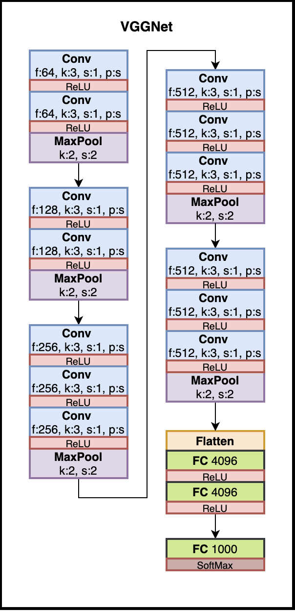

# VGG16_Architecture

VGG16 (also called OxfordNet) is a convolutional neural network architecture named after the Visual Geometry Group from Oxford, who developed it.
It was used to win the ILSVR (ImageNet) competition in 2014.

